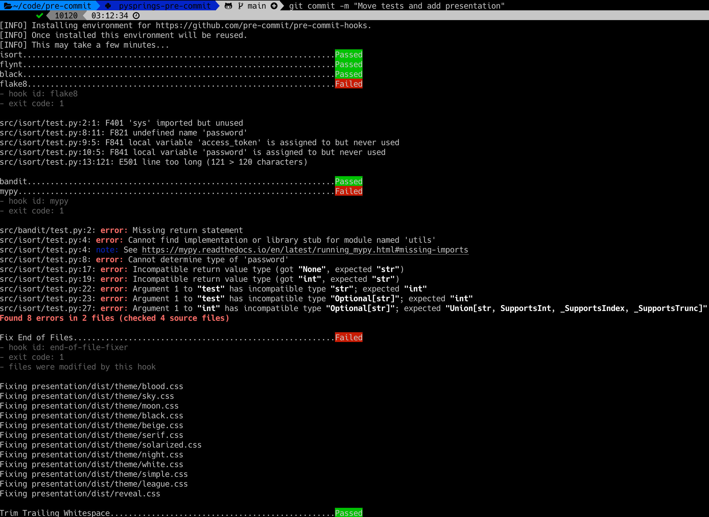
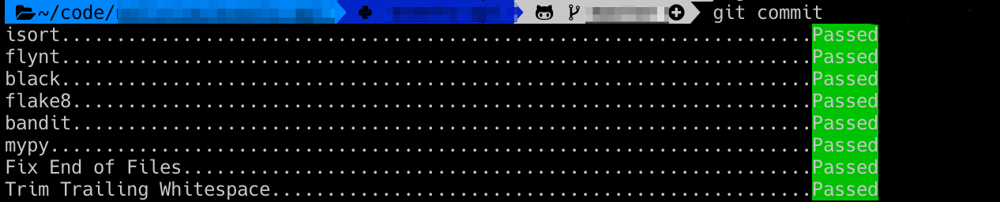

# Usage

---

## Setup your IDE/Editor

    
    

---

## Install pre-commit hook

```bash
pre-commit install
git add .
git commit -m "Some bad code"
```

Note:
- You can configure pre-commit to use any sort of hooks, pre/post push, pre/post message, etc.
- pre-commit runs only for the staged files, not the entire project. And only relevant linters/formatters are applied.

---



Note:
- Linters only show errors but generally don't fix the issue.
- Formatters automatically fix the code so you'll unstaged changes.
---



---

## Continuous Integration

```bash
pre-commit run --all-files
```

Note:
Devs can skip hooks with `git commit --no-verify`.
